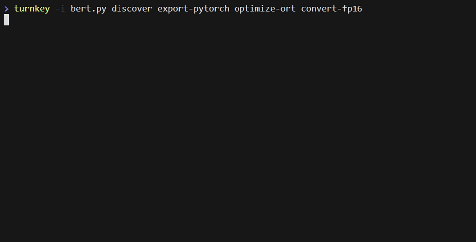

# TurnkeyML Classic

## Getting Started

### Quick Start

The easiest way to get started is:
1. `pip install turnkeyml`
2. Copy a PyTorch example of a model, like the one on this [Huggingface BERT model card](https://huggingface.co/google-bert/bert-base-uncased), into a file named `bert.py`.
```python
from transformers import BertTokenizer, BertModel
tokenizer = BertTokenizer.from_pretrained('bert-base-uncased')
model = BertModel.from_pretrained("bert-base-uncased")
text = "Replace me by any text you'd like."
encoded_input = tokenizer(text, return_tensors='pt')
output = model(**encoded_input)
```
3. `turnkey -i bert.py discover export-pytorch`: make a BERT ONNX file from this `bert.py` example.

## Demo

Here's `turnkey` in action: BERT-Base is exported from PyTorch to ONNX using `torch.onnx.export`, optimized for inference with `onnxruntime`, and converted to fp16 with `onnxmltools`:



Breaking down the command `turnkey -i bert.py discover export-pytorch optimize-ort convert-fp16`:

1. `turnkey -i bert.py` feeds [`bert.py`](https://github.com/onnx/turnkeyml/blob/main/models/transformers/bert.py), a minimal PyTorch script that instantiates BERT, into the tool sequence, starting with...
1. `discover` is a tool that finds the PyTorch model in a script and passes it to the next tool, which is...
1. `export-pytorch`, which takes a PyTorch model and converts it to an ONNX model, then passes it to...
1. `optimize-ort`, which uses `onnxruntime` to optimize the model's compute graph, then passes it to...
1. `convert-fp16`, which uses `onnxmltools` to convert the ONNX file into fp16.
1. Finally, the result is printed, and we can see that the requested `.onnx` files have been produced.

All without writing a single line of code or learning how to use any of the underlying ONNX ecosystem tools 🚀

## Learn More

The easiest way to learn more about `turnkey` is to explore the help menu with `turnkey -h`. To learn about a specific tool, run `turnkey <tool name> -h`, for example `turnkey export-pytorch -h`.

We also provide the following resources:

- [Installation guide](https://github.com/onnx/turnkeyml/blob/main/docs/install.md): how to install from source, set up Slurm, etc.
- [User guide](https://github.com/onnx/turnkeyml/blob/main/docs/tools_user_guide.md): explains the concepts of `turnkey's`, including the syntax for making your own tool sequence.
- [Examples](https://github.com/onnx/turnkeyml/tree/main/examples/cli): PyTorch scripts and ONNX files that can be used to try out `turnkey` concepts.
- [Code organization guide](https://github.com/onnx/turnkeyml/blob/main/docs/code.md): learn how this repository is structured.
- [Models](https://github.com/onnx/turnkeyml/blob/main/models/readme.md): PyTorch model scripts that work with `turnkey`.

## Mass Evaluation

`turnkey` is used in multiple projects where many hundreds of models are being evaluated. For example, the [ONNX Model Zoo](https://github.com/onnx/models) was created using `turnkey`.

We provide several helpful tools to facilitate this kind of mass-evaluation.

### Wildcard Input

`turnkey` will iterate over multiple inputs if you pass it a wildcard input. 

For example, to export ~1000 built-in models to ONNX:

```
> turnkey models/*/*.py discover export-pytorch
```

### Results Cache

All build results, such as `.onnx` files, are collected into a cache directory, which you can learn about with `turnkey cache -h`.

### Generating Reports

`turnkey` collects statistics about each model and build into the corresponding build directory in the cache. Use `turnkey report -h` to see how those statistics can be exported into a CSV file.

### System Information

System information for the current `turnkey` installation is collected and viewed with the `system-info` management tool:

```
> turnkey system-info
```

## Extensibility

### Models

[](https://github.com/onnx/turnkeyml/tree/main/models/transformers "Transformer models")
[](https://github.com/onnx/turnkeyml/tree/main/models/graph_convolutions "Graph Convolution models")
[](https://github.com/onnx/turnkeyml/tree/main/models/torch_hub "Models from Torch Hub")
[](https://github.com/onnx/turnkeyml/tree/main/models/torchvision "Models from Torch Vision")
[](https://github.com/onnx/turnkeyml/tree/main/models/timm "Pytorch Image Models")

This repository is home to a diverse corpus of hundreds of models, which are meant to be a convenient input to `turnkey -i <model>.py discover`. We are actively working on increasing the number of models in our model library. You can see the set of models in each category by clicking on the corresponding badge.

Evaluating a new model is as simple as taking a Python script that instantiates and invokes a PyTorch `torch.nn.module` and call `turnkey` on it. Read about model contributions [here](https://github.com/onnx/turnkeyml/blob/main/docs/contribute.md#contributing-a-model).

### Plugins

The build tool has built-in support for a variety of interoperable `Tools`. If you need more, the TurnkeyML plugin API lets you add your own installable  tools with any functionality you like:

```
> pip install -e my_custom_plugin
> turnkey -i my_model.py discover export-pytorch my-custom-tool --my-args
```

All of the built-in `Tools` are implemented against the plugin API. Check out the [example plugins](https://github.com/onnx/turnkeyml/tree/main/examples/cli/plugins) and the [plugin API guide](https://github.com/onnx/turnkeyml/blob/main/docs/contribute.md#contributing-a-plugin) to learn more about creating an installable plugin.